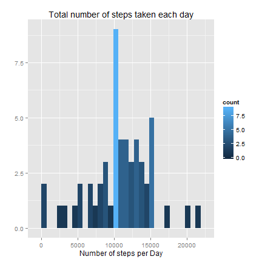

# Reproducible Research: Peer Assessment 1

first of all set the global parameters for knitr rendering


```r
opts_chunk$set(echo=TRUE, fig.width=6, fig.height=6)
```


## Loading and preprocessing the data

This is the R Code for loading the Data used for this Peer Assessment.
(please feel free and change the path)


```r
myD <- setwd("C:/Users/rosenranz/Documents/_coursera/src/RepData_PeerAssessment1")
filename <- "activity"
if(!file.exists(paste0(filename,".csv"))){
        unzip(paste0(filename,".zip"))
}        
o.data <- read.csv2(paste0(filename,".csv"), 
                    sep = ",", na.strings = "NA", 
                    header = TRUE, stringsAsFactors=FALSE)
```


## What is mean total number of steps taken per day?

For this part of the assignment, we can ignore the missing values in the dataset.
NOw, before we can plot a histogramm, we have to aggregate the original data to get the total number of steps taken each day.


```r
agg.data.all <- with(o.data, aggregate(steps, 
                                   list(Date = factor(date)), 
                                   sum))
```

To plot the histogram, i use the ggplot2 package.


```r
library(ggplot2)
p <- ggplot(agg.data.all, aes(x)) + geom_histogram(aes(fill = ..count..))
p <- p + labs(list(x="Number of steps per Day", y="", title="Total number of steps taken each day"))
print(p)
```

```
## stat_bin: binwidth defaulted to range/30. Use 'binwidth = x' to adjust this.
```

 

Calculate the mean and median total number of steps taken per day


```r
c.mean <- mean(agg.data.all$x, na.rm = TRUE)
c.median <- median(agg.data.all$x, na.rm = TRUE)
```

So, the mean of total number of steps taken per day is **1.0766 &times; 10<sup>4</sup>** and the median **10765**.


## What is the average daily activity pattern?


## Imputing missing values


## Are there differences in activity patterns between weekdays and weekends?
